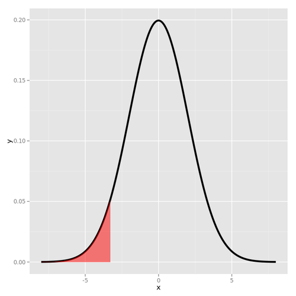

These are  my notes on the Statistical Inference course (2th part) : Hypothesis Testing and t-tests


## CLT : Central Limit Theorem

The distribution of sample statistics (e.g. mean) is approximatively normal, regardless of the underlying distribution, with mean = $\mu$ and variance = $\sigma^2$

$\bar{X} \sim N(mean = \mu, sd = \frac{\sigma}{\sqrt{n}})$ 


*Conditions for CLT*

  * Independence : Sampled observations must be independent 
    - random sample / assignment
    - if sampling without replacement, n < 10 % of population)
  * Sample Size / skew :
    - population should be normal
    - if not sample size should be large (rule of thumb > 30)

*Confidence Interval*

An interval estimate of a population parameter.  
It is computed as sample mean +/- margin of error (SE, ie. standard error) :  
$\bar x = z \times SE$ where $SE = \frac{s}{\sqrt{n}}$  
A 95% confidence interval would contain 95% of all values and would be $x \pm 2SE$ or $x \pm 1.96 \times \frac{s}{\sqrt{n}}$


1.96 correspond to the 95% + 2.5% = 97.5% quantile, according to the Z table ( find 0.975 in the table and add the column header with the row header).


Example:

You have taken a random sample of 100 primary school children. Their heights had mean = 150cm and sd = 10 cm. We estimate the true average height of primary school children based on this sample using a 95% confidence interval.

$\bar{x} = z \times SE = x\bar \pm 1.96 \times \frac{s}{\sqrt{n}} = 150 \pm 1.96 \times \frac{10}{\sqrt{100}} = 150 \pm \times 1.96 \times 1 = (148.04, 151.96)$

We are 95% confident that primary school children mean height is between 148.04cm and 151.96cm.


## Required sample size for margin of error

Given a target margin of error and confidence level, and the standard deviation of a sample (or population), we can work backwards to determine the required sample size.

Example :

From previous measurements of primary school heights. What should be the sample size in order to get a 95% confidence interval with a margin of error less or equal to 1 cm:

$ME = z \times SE$

$1 = 1.96 \times \frac{10}{\sqrt{n}}$

$n = \frac{1.95 \times 10}{1}^2$

Thus we need a sample size of at least 195 primary school children.

## Hypothesis testing

Hypothesis testing is concerned with making decisions using data. It compares the data being studied to an observed characteristic of the population from which the data are sampled.
The researcher has a proposed hypothesis about a population characteristic and conducts a study to discover if it is reasonable, or, acceptable. The proposed hypothesis is called the alternative hypothesis and is labelled Ha.

Null Hypothesis $H_0$ : The status quo that is assumed to be true.   
Alternative hypothesis : $H_a$ : An alternative claim under consideration that will require statistical evidence to accept, and thus, reject the null hypothesis. The alternative hypothesis claims that the population characteristic is different than the observed parameter. This difference is either that the characteristic has increased, decreased, or, possibly either increased or decreased.

The alternative hypotheses are typically of the form < (decrease), > (increase) or $\neq$ (either increase or decrease).
We have four possible outcomes:

Truth   |   Decide      |       Result
--------|---------------|-------------------------------
H0      |       H0      |       Correctly accept null
H0      |       Ha      |       Type I error (False Positive, falsely claims a significant result)
Ha      |       Ha      |       Correctly reject null
Ha      |       H0      |       Type II error (False Negative falsely claims a nonsignificant result)

A test statistic is used to make an assumtion, the null is made upon this assumption. The test statistic will have a certain likelihood for occuring, according to the distribution being used. When this likelihood is small, this indicates that the sample data are either from an unusual sample, or, that the distribution of the population actually is different than assumed. 
If the sample is properly drawn, there is small risk that the sample is unusual, and, so, it is safe to draw a conclusion that the distribution may be changed.  This allows the conclusion that the null hypothesis may have changed, and that the alternative hypothesis might be accepted instead.  This conclusion leads the researcher to "reject" the null hypothesis.

Example:

From previous example, does the data support the hypothesis that primary school children on average are shorter than 151cm?

$H_0 : \mu_0 = 151$ 

$H_a : \mu_0 < 151$

Assuming $H_0$, how unusual or extreme is the sample value we get from our OBSERVED data? or
Assuming $H_0$, what is the probability to obtain the observed data (ie. a mean of 150cm < 151 cm, with a sd=10cm) or a more extreme values?

An equivalent question is, assuming $H_0$, ie. assuming X' normally distributed with $X' \sim N(150, 1)$, what is the probability to obtain a standard deviation at least that far from the mean? 

We must determine how our hypothesis mean is far from our OBSERVED sample mean, that's the z-score:

$Z = \frac{\bar{X} - \mu}{\bar{\sigma_X}} = \frac{150 - 151}{1} = -1$

Our observed data are -1 standard deviation from the hypothesis mean.

A reasonable strategy would be : do not reject the null hypothesis, ie "primary school children have mean height of 151 cm", if there is more than x% chance of getting a random sample of 100 children with a sample mean 150, with x enough hight (more than 5% usually).

The 5% is considered as the region of rejection, if the z score is outside the region of rejection (determined by $alpha$), we fail to reject $H_0$.

The p-value is the probability under the null hypothesis of obtaining evidence as or more extreme than your z-score or test statistic (obtained from your observed data) in the direction of the alternative hypothesis.
So if the p-value (probability of seeing your test statistic) is small, then one of two things happens. EITHER $H_0$ is true and you have observed a rare event (in this unusual test statistic) OR $H_0$ is false.

The p-value is as an attained significance level, ie. the smallest value of alpha at which you will reject the null hypothesis.

## P-value

Probability of obtaining the observed result or results that are more "extreme", given that hypothesis is true, ie P(observed or more extreme outcome | $H_0$).

A reasonable strategy would reject the null hypothesis if the sample mean $\bar X$ is larger or lower than some constant C, chosen so that the probabilty of a Type I error is $\alpha$

Note:
  $C = \mu + qnorm(\alpha) \times sd$
  instead of computing a constant C as a cutpoint for accepting or rejecting $H_0$, we simply compute a Z-score based on alpha, the number of standard deviations the sample mean is from the hypothesized mean.

If the p-value is low (ie. lower than the significant level ($\alpha$), usually 5% as a standard level of rejection), then we saw that is very unlikely to observe the data if the null hypothesis is true and reject it.

If the p-value is high (ie. higher than ($\alpha$), we say that it is likely to observe the data even if the null hypothesis was true, and thus do not reject it.

Example:

From the previous example, with a significant level equal to 0.05:

$\bar{X} \sim N(\mu = 151, SE = 1)$ #Null hypothesis

Test Statistic or Z-score:

$Z = \frac{X\bar - mu}{SE} = \frac{150 - 151}{1} = -1$

The probability that we are at most -1 standard deviation from the mean:

$P\left(Z \le 1\right) = 1 - 0.8413 = 0.1587$

This probability can be computed with the qnorm R function:

```r
pnorm(-1)
```

```
## [1] 0.1586553
```

If we assume $H_0$ ($mu = 151$), the probability of getting a sample this "extreme" ($mu = 150$) or actually more extreme is 15.9%.
Since p-value is higher than 5%, we don't to reject $H_0$.


Interpretation :

* If in fact, primary school children have mean height of 151 cm, there is a 15,9% chance that a random sample of 100 children would yield a sample mean of 150cm or lower.
* This is a pretty hight probability
* Thus the sample mean of 150 could have likely occured by chance.

## Two-sided Hypothesis testing

The test above was a one-side or one-tailed test.
What is the probability that the children have mean height different from 151cm?

$H_0 : \mu = 151$ 

$H_a : \mu \neq 151$

We could reject $H_0$ (and accept $H_a$) when our sample mean is significant different that 151, that is either less than OR greater that 151. 
We consider values at both tails at the .025 and the .975 percentiles.
This means that the test statistic is less than .025, Z_(alpha/2), or greater than .975, Z_(1-alpha/2).
Notice that if we reject H_0, either it was FALSE (and hence our model is wrong and we are correct to reject it) OR H_0 is TRUE and we have made an error (Type I). The probability of this is 5%.

P-value:

$P\left(Z \le 1\right) +  P\left(Z \ge 1\right) = 2 \times (1-0.8413) = 0.3174$

With R:


```r
2 * pnorm(-1)
```

```
## [1] 0.3173105
```

## Decision rule

Right Tailed Test:   
$H_0 : \mu = \mu_0$ parameter = value   
$H_a : \mu < \mu_0$ parameter  < value   
with alpha = 0.5   
ie. if sqrt(n) * ( X' - mu) / s > Z_{1-alpha}   
ie. if Z is more that Z_95 (the 95% percentile) standard deviations to the right of the mean $\mu_0$   


```r
Z_95 <- qnorm(0.95)
Z_95
```

```
## [1] 1.644854
```

<div class="rimage center"></div>

Right Tailed Test:   
$H_0 : \mu = \mu_0$ parameter = value   
$H_a : \mu > \mu_0$ parameter > value   
Reject $H_0$, if sqrt(n) * ( X' - mu) / s < Z_{alpha}, ie. if Z is more than Z_5 standard deviations (the 5% quantile) to the left of the mean $\mu_0$


```r
Z_5 <- qnorm(0.05)
Z_5
```

```
## [1] -1.644854
```

<div class="rimage center"></div>


Two Tailed Test:   
$H_0 : \mu = \mu_0$ parameter = value   
$H_a : \mu \neq \mu_0 parameter \neq value$  (Another way to write not equal is < or >)   
Reject $H_0$, if the test statistics is in the region of rejection, .ie if it is larger than Z_95 or smaller than Z_5.   

The decision rule can be summarized as follows:

Reject $H_0$ if the test statistic falls in the critical region (reject $H_0$ if the test statistic is more extreme than the critical value or reject $H_0$ ), otherwise, we fail to reject $H_0$.

The p-value tells us if the test statistic is inside our outside the region.   
Reject $H_0$ if p-value is less that the specified $\alpha$, otherwise, we fail to reject $H_0$.

Note : I you fail to reject the one sided test, you know that you will fail to reject the two sided.


```
## [1] 1.644854
```
the 95% percentile corresponds to the value 1.64 (see also zthe z table above).


## Hypothesis tests and Confidence Intervals

They're equivalent.
If you set alpha to some value (say .05) and ran many tests checking alternative hypotheses against H_0, that mu=mu_0, the set of all possible values for which you fail to reject H_0 forms the (1-alpha)% (that is 95%) confidence interval for $mu_0$.
Similarly, if a (1-alpha)% interval contains mu_0, then we fail to reject H_0.

So, to resume:
If the confidence interval contains the null value ($mu_0$, the value of $H_0$), don't reject $H_0$.
If the confidence interval does not contain the null value, reject $H_0$, cause this tells us that either our hypothesis is wrong or we're making a mistake (Type 1) in rejecting it.

Previously, we found the 95% interval for heights of primary school children to be (148, 152). Given that our null hypothesis ($H_0 = 151$) falls within this 95% Cl, we do not reject it.


              <- 95% confident that the av is somewherer in here ->
    ---------|-----------------------------------------------------|---------
             148cm                                                 152


A two-sided hypothesis with significance level $\alpha$ is equivalent to a confidence interval with $CL = 1 - \alpha$. 
A one-sided hypothesis with significance level $\alpha$ is equivalent to a confidence interval with $CL = 1 - 2\alpha$. 

## Type II error
 Let the probability of a type II error (accepting H_0 when it is false) to be beta.
The term POWER refers to the quantity 1-beta and it represents the probability of rejecting $H_0$ when it's false. This is used to determine appropriate sample sizes in experiments.

## The t distribution

So far, we use normal distribution and implicitly relying on the Central Limit Theorem.
According to CLT, the distribution of sample statistics is approximatively normal, if:
* Population is normal
* Sample size is large (n> 30)
If so, we can use the population sd ($s\sigma$) to compute a z-score.

However, when we deal with small sample size and do not know the standard deviation of the population ($\sigma$), we rely on the t distribution.
The test statistic is the same as above $\frac{\left(X'-\mu\right)}{\sigma}$ ie. $\frac{\left(X'- \mu\right)}{s/\sqrt{n}}$ and the test statistic is compared to $t_{1-\alpha, df}$ or/and $t_{\alpha, df}$ (with df the degree of freedom = size - 1).

Shape of the distribution:
* Observations are more likely to fall beyond 2 sd from the mean
* The thicker tails are helpful in adjusting for the less reliable data on the standard deviation.
The t distribution has one parameter, degrees of freedom (df) which determines the thickness of the tail

Under $H_0$, the probability that the test statistic is larger than the 95th percentile of the t distribution is 5%. The associated quantile is:


```r
n <- 16  # sample size
pt(q = 2.5, df = 15, lower.tail = FALSE)
```

```
## [1] 0.0122529
```
the P(X > 2.5) if $H_0$ were true. We would see this large a test statistic with probability 1% which is rather a small probability.

* df refers to the number of independent observations in data set
* nb of independent observations = sample size - 1

When df increases, the t distribution approaches the normal distribution.

Normal distribution vs t distribution: if you're unsure which one to use, use the t distribution since it approximates to the normal distribution with large sample sizes.

T table


## Independent and dependent t-tests

Dependent : when evaluating the effect between two related samples. Example : You feed a group of 100 people fast food everyday, did they gain weight?

Independent : when evaluating the effect between two independent sample: You feed 50 males and 50 males fast food everyday. Did males or females gain more weight after 30 days?


## Using the t.test function

From the father.son library, which contains 1078 measurements of a father's height and his son's height.


```r
library("UsingR")
data(father.son)
t.test(father.son$sheight - father.son$fheight)
```

```
## 
## 	One Sample t-test
## 
## data:  father.son$sheight - father.son$fheight
## t = 11.789, df = 1077, p-value < 2.2e-16
## alternative hypothesis: true mean is not equal to 0
## 95 percent confidence interval:
##  0.8310296 1.1629160
## sample estimates:
## mean of x 
## 0.9969728
```

```r
t <- t.test(father.son$sheight - father.son$fheight)$t
t.test(father.son$sheight, father.son$fheight, paired = TRUE)
```

```
## 
## 	Paired t-test
## 
## data:  father.son$sheight and father.son$fheight
## t = 11.789, df = 1077, p-value < 2.2e-16
## alternative hypothesis: true difference in means is not equal to 0
## 95 percent confidence interval:
##  0.8310296 1.1629160
## sample estimates:
## mean of the differences 
##               0.9969728
```

The test statistic is 11.789 which is quite hight so we reject the null hypothesis that the true mean of the difference is 0, (if you ran the test on the difference sheight-fheight) or that the true difference in means was 0 (if you ran the test on the two separate but paired columns).

Note the 95% confidence interval, 0.8310296 1.1629160, returned by t.test. It does not contain the hypothesized population mean 0 so we're pretty confident we can safely reject the hypothesis. This tells us that either our hypothesis is wrong or we're making a mistake (Type 1) in rejecting it.


<!--
Sources 
http://statstutorstl.blogspot.fr/search/label/inferential%20statistics
http://fr.slideshare.net/eugeneyan/statistical-inference-3
-->
