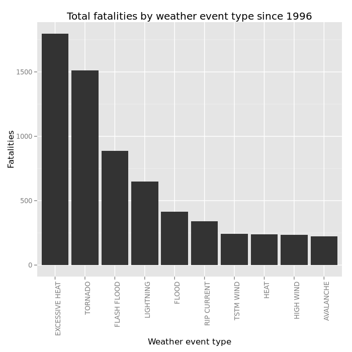
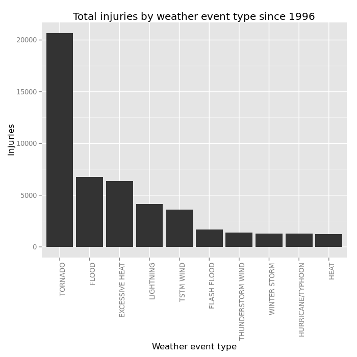
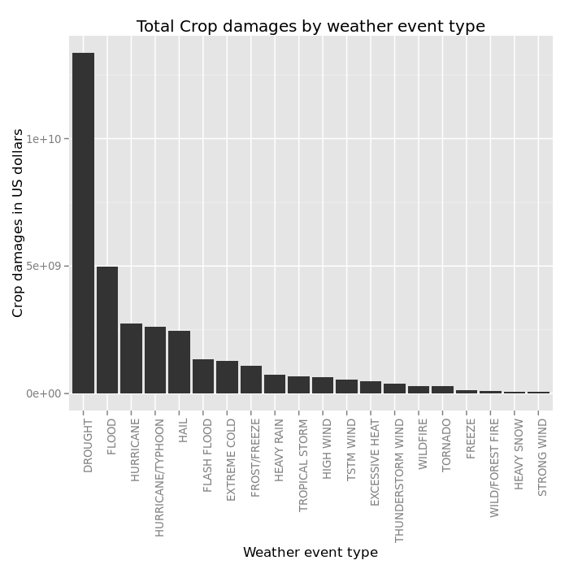
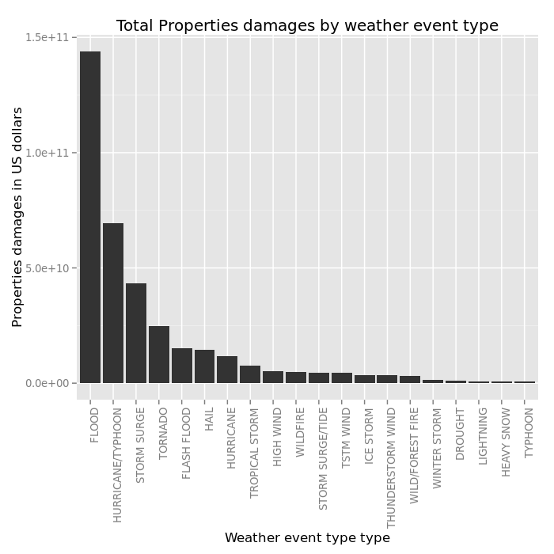

##Synopsis

This analysis involves exploring the U.S. National Oceanic and Atmospheric Administration's (NOAA) storm database. 

This database tracks characteristics of major storms and weather events in the United States, including when and where they occur, as well as estimates of any fatalities, injuries, and property damage.

This analysis focuses on fatalities, injuries, property and crop damages to answer to the 2 following questions : 
Across the United States, which types of events (as indicated in the EVTYPE variable) are most harmful with respect to population health?
Across the United States, which types of events have the greatest economic consequences?


## Data Processing
The data comes in the form of a comma-separated-value file compressed via the bzip2.

We download it and unzip it in a ProjectData directory:

```r
download.file("https://d396qusza40orc.cloudfront.net/repdata%2Fdata%2FStormData.csv.bz2", "FStormData.csv.bz2", 
    method = "curl", quiet = TRUE)

raw <- read.csv(bzfile("FStormData.csv.bz2"), sep = ",", quote = "\"", header = TRUE, stringsAsFactors = FALSE)
raw$BGN_DATE <- as.Date(raw$BGN_DATE, format = "%m/%d/%Y %H:%M:%S")
raw$END_DATE <- as.Date(raw$END_DATE, format = "%m/%d/%Y %H:%M:%S")
```

The Storm Events Database reports that all weather events are only recorded since 1996 (see http://www.ncdc.noaa.gov/stormevents/details.jsp).

        Event Types Available:
        Add more info about event types here. Link to collections page/tab when referencing data collection source.

        1. Tornado: From 1950 through 1954, only tornado events were recorded.
        
        2. Tornado, Thunderstorm Wind and Hail: From 1955 through 1992, only tornado, thunderstorm wind and hail events were keyed from the paper publications into digital data. From 1993 to 1995, only tornado, thunderstorm wind and hail events have been extracted from the Unformatted Text Files.
        
        3. All Event Types (48 from Directive 10-1605): From 1996 to present, 48 event types are recorded as defined in NWS Directive 10-1605. 

Since we're reporting impacts from various weather events, we'll focus our study on data since 1996.


```r
data <- raw[raw$BGN_DATE > "1996-01-01", ]
rm(raw)
```

##Results
*Weather events impact on population health across the United States since 1996*

To study the weather events impact on poulation health, we examine the INJURIES AND FATALITIES columns of the dataset.

We compute the sum of total of injuries/fatalities by weather event type an store the values in a new dataset:

```r
fat_by_ev <- aggregate(FATALITIES ~ EVTYPE, data = data, sum, na.rm = TRUE)
inj_by_ev <- aggregate(INJURIES ~ EVTYPE, data = data, sum, na.rm = TRUE)
```

For fatalities, the quantile function shows that only 1% of the values of the total of injuries/fatalities by event type are significant (> 326 fatalities, > 1635 injuries).


```r
quantile(fat_by_ev$FATALITIES, probs = seq(0.9, 1, 0.01))
```

```
##     90%     91%     92%     93%     94%     95%     96%     97%     98%     99%    100% 
##    4.00    5.74    9.88   14.02   28.80   57.90   78.08  105.32  198.92  326.14 1797.00
```

```r
quantile(inj_by_ev$INJURIES, probs = seq(0.9, 1, 0.01))
```

```
##      90%      91%      92%      93%      94%      95%      96%      97%      98%      99%     100% 
##    21.60    25.74    39.76    70.04    85.76   171.90   304.56   477.80  1034.84  1635.64 20667.00
```

We order the new datas by fatalities/injuries (decreasing order) and display the 10th first rows:

```r
fat_temp <- fat_by_ev[order(fat_by_ev$FATALITIES, decreasing = TRUE), ][1:10, ]
colnames(fat_temp) <- c("event.type", "fatalities")
inj_temp <- inj_by_ev[order(inj_by_ev$INJURIES, decreasing = TRUE), ][1:10, ]
colnames(inj_temp) <- c("event.type", "injuries")
library(knitr)
kable(fat_temp, caption = "Total fatalities by weather event type since 1996")
```


|    |event.type     | fatalities|
|:---|:--------------|----------:|
|75  |EXCESSIVE HEAT |       1797|
|417 |TORNADO        |       1511|
|96  |FLASH FLOOD    |        887|
|213 |LIGHTNING      |        650|
|99  |FLOOD          |        414|
|286 |RIP CURRENT    |        340|
|423 |TSTM WIND      |        241|
|143 |HEAT           |        237|
|161 |HIGH WIND      |        235|
|16  |AVALANCHE      |        223|

```r
kable(inj_temp, caption = "Total injuries by weather event type since 1996")
```


|    |event.type        | injuries|
|:---|:-----------------|--------:|
|417 |TORNADO           |    20667|
|99  |FLOOD             |     6758|
|75  |EXCESSIVE HEAT    |     6391|
|213 |LIGHTNING         |     4140|
|423 |TSTM WIND         |     3629|
|96  |FLASH FLOOD       |     1674|
|413 |THUNDERSTORM WIND |     1400|
|496 |WINTER STORM      |     1292|
|167 |HURRICANE/TYPHOON |     1275|
|143 |HEAT              |     1222|

Then plot the datas:

```r
library(ggplot2)
ggplot(fat_temp, aes(reorder(factor(event.type), -fatalities), fatalities)) + geom_bar(stat = "identity") + 
    labs(x = "Weather event type", y = "Fatalities", title = "Total fatalities by weather event type since 1996") + 
    theme(axis.text.x = element_text(angle = 90, hjust = 1))
```

<div class="rimage center"></div>


```r
ggplot(inj_temp, aes(reorder(factor(event.type), -injuries), injuries)) + geom_bar(stat = "identity") + 
    labs(x = "Weather event type", y = "Injuries", title = "Total injuries by weather event type since 1996") + 
    theme(axis.text.x = element_text(angle = 90, hjust = 1))
```

<div class="rimage center"></div>

        
To go deeper, we can examine single weather types by having a closer look on their frequency/injuries and fatalities ratio :


```r
library(plyr)
fat_ev_count <- count(data[data$FATALITIES > 0, ], vars = "EVTYPE")

temp <- merge(fat_ev_count, fat_by_ev, by = "EVTYPE")
temp$ratio <- temp$FATALITIES/temp$freq
colnames(temp) <- c("event.type", "event.frequency", "event.fatalities", "event.fatalities.ratio")
kable(temp[order(temp$event.frequency, decreasing = TRUE), ][1:30, ], caption = "Total fatalities by weather event type (ordered by frequency desc) since 1996")
```


|    |event.type              | event.frequency| event.fatalities| event.fatalities.ratio|
|:---|:-----------------------|---------------:|----------------:|----------------------:|
|63  |LIGHTNING               |             608|              650|               1.069079|
|27  |FLASH FLOOD             |             584|              887|               1.518836|
|20  |EXCESSIVE HEAT          |             564|             1797|               3.186170|
|92  |TORNADO                 |             459|             1511|               3.291939|
|74  |RIP CURRENT             |             301|              340|               1.129568|
|28  |FLOOD                   |             270|              414|               1.533333|
|94  |TSTM WIND               |             212|              241|               1.136793|
|75  |RIP CURRENTS            |             179|              202|               1.128492|
|48  |HIGH WIND               |             176|              235|               1.335227|
|1   |AVALANCHE               |             173|              223|               1.289017|
|38  |HEAT                    |             133|              237|               1.781955|
|104 |WINTER STORM            |             118|              191|               1.618644|
|90  |THUNDERSTORM WIND       |             107|              130|               1.214953|
|85  |STRONG WIND             |              90|              103|               1.144444|
|22  |EXTREME COLD/WIND CHILL |              87|              125|               1.436782|
|21  |EXTREME COLD            |              86|              113|               1.313953|
|41  |HEAVY SNOW              |              75|              107|               1.426667|
|11  |COLD/WIND CHILL         |              74|               95|               1.283784|
|45  |HIGH SURF               |              63|               87|               1.380952|
|39  |HEAVY RAIN              |              59|               94|               1.593220|
|58  |ICE STORM               |              51|               82|               1.607843|
|3   |BLIZZARD                |              46|               70|               1.521739|
|29  |FOG                     |              35|               60|               1.714286|
|105 |WINTER WEATHER          |              29|               33|               1.137931|
|101 |WILDFIRE                |              28|               75|               2.678571|
|43  |HEAVY SURF/HIGH SURF    |              27|               42|               1.555556|
|93  |TROPICAL STORM          |              24|               57|               2.375000|
|49  |HURRICANE               |              23|               61|               2.652174|
|98  |URBAN/SML STREAM FLD    |              22|               28|               1.272727|
|50  |HURRICANE/TYPHOON       |              19|               64|               3.368421|

```r
inj_ev_count <- count(data[data$INJURIES > 0, ], vars = "EVTYPE")
temp <- merge(inj_ev_count, inj_by_ev, by = "EVTYPE")
temp$ratio <- temp$INJURIES/temp$freq
colnames(temp) <- c("event.type", "event.frequency", "event.injuries", "event.injuries.ratio")
kable(temp[order(temp$event.frequency, decreasing = TRUE), ][1:30, ], caption = "Total Injuries by weather event type (ordered by frequency desc) since 1996")
```


|    |event.type           | event.frequency| event.injuries| event.injuries.ratio|
|:---|:--------------------|---------------:|--------------:|--------------------:|
|56  |LIGHTNING            |            2250|           4140|             1.840000|
|85  |TORNADO              |            1877|          20667|            11.010655|
|87  |TSTM WIND            |            1492|           3629|             2.432306|
|83  |THUNDERSTORM WIND    |             587|           1400|             2.385009|
|43  |HIGH WIND            |             403|           1083|             2.687345|
|23  |FLASH FLOOD          |             335|           1674|             4.997015|
|99  |WILDFIRE             |             184|            911|             4.951087|
|34  |HAIL                 |             165|            713|             4.321212|
|17  |EXCESSIVE HEAT       |             162|           6391|            39.450617|
|79  |STRONG WIND          |             147|            278|             1.891156|
|101 |WINTER STORM         |             144|           1292|             8.972222|
|24  |FLOOD                |             142|           6758|            47.591549|
|98  |WILD/FOREST FIRE     |             130|            545|             4.192308|
|68  |RIP CURRENT          |             107|            209|             1.953271|
|1   |AVALANCHE            |             105|            156|             1.485714|
|38  |HEAVY SNOW           |             102|            698|             6.843137|
|69  |RIP CURRENTS         |              84|            294|             3.500000|
|25  |FOG                  |              73|            712|             9.753425|
|37  |HEAVY RAIN           |              73|            230|             3.150685|
|51  |ICE STORM            |              53|            318|             6.000000|
|3   |BLIZZARD             |              41|            385|             9.390244|
|15  |DUST STORM           |              38|            376|             9.894737|
|36  |HEAT                 |              36|           1222|            33.944444|
|42  |HIGH SURF            |              33|            146|             4.424242|
|102 |WINTER WEATHER       |              30|            343|            11.433333|
|90  |TSTM WIND/HAIL       |              26|             95|             3.653846|
|95  |URBAN/SML STREAM FLD |              26|             79|             3.038461|
|100 |WIND                 |              26|             84|             3.230769|
|86  |TROPICAL STORM       |              23|            338|            14.695652|
|11  |DENSE FOG            |              20|            143|             7.150000|

*Weather events economic impact across Unites States*

We'll examine the property and crop damages columns (PROPDMG * 10^PROPDMGEXP and CROPDMG * 10^CROPDMGEXP, respectively) from the dataset.

We need to preprocess the data to convert PROPDMG and PROPDMGEXP into numbers, idem for CROPDMG and CROPDMGEXP.

Values for the CROPDMGEXP and PROPDMEXP are:

* 0 or blank
* H for Hundred
* K for Thousand
* M for Million
* B for Billion

Note: Except for these exponential values (H,K,M,B), there is some inexpected values : ? + - and numbers in the initial dataset. This values doesn't appear in the dataset filtered by BGN_DATE > 1996-01-01.

Let's check the repartition of the exponential categories:

```r
table(data$CROPDMGEXP)
```

```
## 
##             B      K      M 
## 373047      4 278685   1771
```

```r
table(data$PROPDMGEXP)
```

```
## 
##             0      B      K      M 
## 276166      1     32 369934   7374
```

We convert PROPDMG/PROPDMGEXP and CROPDMG/CROPDMGEXP pairs into numbers:

```r
data$cropdmg.exp <- 1
data[data$CROPDMGEXP == "H", "cropdmg.exp"] <- 100
data[data$CROPDMGEXP == "K", "cropdmg.exp"] <- 1000
data[data$CROPDMGEXP == "M", "cropdmg.exp"] <- 10^6
data[data$CROPDMGEXP == "B", "cropdmg.exp"] <- 10^9
data$cropdmg.val <- data$CROPDMG * data$cropdmg.exp

data$propdmg.exp <- 1
data[data$PROPDMGEXP == "H", "propdmg.exp"] <- 100
data[data$PROPDMGEXP == "K", "propdmg.exp"] <- 1000
data[data$PROPDMGEXP == "M", "propdmg.exp"] <- 1e+06
data[data$PROPDMGEXP == "B", "propdmg.exp"] <- 1e+09
data$propdmg.val <- data$PROPDMG * data$propdmg.exp
```

We perform the same analysis as for weather type impact on population health:

```r
crop_by_ev <- aggregate(cropdmg.val ~ EVTYPE, data = data, sum, na.rm = TRUE)
quantile(crop_by_ev$cropdmg.val, probs = seq(0.9, 1, 0.01))
```

```
##         90%         91%         92%         93%         94%         95%         96%         97% 
##       80000      522000     1830000     8518338    15105600    22067850    51986350   225801006 
##         98%         99%        100% 
##   611260434  1328471682 13367566000
```

```r
prop_by_ev <- aggregate(propdmg.val ~ EVTYPE, data = data, sum, na.rm = TRUE)
quantile(prop_by_ev$propdmg.val, probs = seq(0.9, 1, 0.01))
```

```
##          90%          91%          92%          93%          94%          95%          96% 
##      6087080      7928162      9823200     19765792     40787880    117527100    551709366 
##          97%          98%          99%         100% 
##   1328347705   4595502763  14205618003 143944833550
```


```r
crop_temp <- crop_by_ev[order(crop_by_ev$cropdmg.val, decreasing = TRUE), ][1:20, ]
colnames(crop_temp) <- c("event.type", "cropdmg.val")
prop_temp <- prop_by_ev[order(prop_by_ev$propdmg.val, decreasing = TRUE), ][1:20, ]
colnames(prop_temp) <- c("event.type", "propdmg.val")
kable(crop_temp, caption = "Total crop damages in (US dollars) by weather event type")
```


|    |event.type        | cropdmg.val|
|:---|:-----------------|-----------:|
|59  |DROUGHT           | 13367566000|
|99  |FLOOD             |  4974778400|
|166 |HURRICANE         |  2741410000|
|167 |HURRICANE/TYPHOON |  2607872800|
|139 |HAIL              |  2476029450|
|96  |FLASH FLOOD       |  1334901700|
|81  |EXTREME COLD      |  1288973000|
|108 |FROST/FREEZE      |  1094086000|
|145 |HEAVY RAIN        |   728169800|
|420 |TROPICAL STORM    |   677711000|
|161 |HIGH WIND         |   633561300|
|423 |TSTM WIND         |   553915350|
|75  |EXCESSIVE HEAT    |   492402000|
|413 |THUNDERSTORM WIND |   398331000|
|487 |WILDFIRE          |   295472800|
|417 |TORNADO           |   283425010|
|102 |FREEZE            |   146225000|
|486 |WILD/FOREST FIRE  |   106782330|
|150 |HEAVY SNOW        |    71122100|
|330 |STRONG WIND       |    64953500|

```r
kable(prop_temp, caption = "Total property damages (in US dollars) by weather event type")
```


|    |event.type        |  propdmg.val|
|:---|:-----------------|------------:|
|99  |FLOOD             | 143944833550|
|167 |HURRICANE/TYPHOON |  69305840000|
|327 |STORM SURGE       |  43193536000|
|417 |TORNADO           |  24616905710|
|96  |FLASH FLOOD       |  15222203910|
|139 |HAIL              |  14595143420|
|166 |HURRICANE         |  11812819010|
|420 |TROPICAL STORM    |   7642475550|
|161 |HIGH WIND         |   5247860360|
|487 |WILDFIRE          |   4758667000|
|328 |STORM SURGE/TIDE  |   4641188000|
|423 |TSTM WIND         |   4478026440|
|191 |ICE STORM         |   3642248810|
|413 |THUNDERSTORM WIND |   3382654440|
|486 |WILD/FOREST FIRE  |   3001782500|
|496 |WINTER STORM      |   1532733250|
|59  |DROUGHT           |   1046101000|
|213 |LIGHTNING         |    743077080|
|150 |HEAVY SNOW        |    634417540|
|437 |TYPHOON           |    600230000|


```r
ggplot(crop_temp, aes(reorder(factor(event.type), -cropdmg.val), cropdmg.val)) + geom_bar(stat = "identity") + 
    labs(x = "Weather event type", y = "Crop damages in US dollars", title = "Total Crop damages by weather event type") + 
    theme(axis.text.x = element_text(angle = 90, hjust = 1))
```

<div class="rimage center"></div>


```r
ggplot(prop_temp, aes(reorder(factor(event.type), -propdmg.val), propdmg.val)) + geom_bar(stat = "identity") + 
    labs(x = "Weather event type type", y = "Properties damages in US dollars", title = "Total Properties damages by weather event type") + 
    theme(axis.text.x = element_text(angle = 90, hjust = 1))
```

<div class="rimage center"></div>

and we check damages ratio by event type:


```r
crop_ev_count <- count(data[data$cropdmg.val > 0, ], vars = "EVTYPE")
temp <- merge(crop_ev_count, crop_by_ev, by = "EVTYPE")
temp$ratio <- temp$cropdmg.val/temp$freq
colnames(temp) <- c("event.type", "event.frequency", "event.cropdamages", "event.cropdamages.ratio")
kable(temp[order(temp$event.frequency, decreasing = TRUE), ][1:20, ], caption = "Total crop domages (in US dollars) by weather event type (ordered by frequency desc) since 1996")
```


|   |event.type           | event.frequency| event.cropdamages| event.cropdamages.ratio|
|:--|:--------------------|---------------:|-----------------:|-----------------------:|
|22 |HAIL                 |            8100|        2476029450|               305682.65|
|46 |TSTM WIND            |            3440|         553915350|               161021.90|
|14 |FLASH FLOOD          |            1845|        1334901700|               723523.96|
|15 |FLOOD                |            1599|        4974778400|              3111180.99|
|44 |TORNADO              |            1254|         283425010|               226016.75|
|43 |THUNDERSTORM WIND    |             924|         398331000|               431094.16|
|4  |DROUGHT              |             243|       13367566000|             55010559.67|
|27 |HIGH WIND            |             200|         633561300|              3167806.50|
|25 |HEAVY RAIN           |             123|         728169800|              5920079.67|
|53 |URBAN/SML STREAM FLD |             112|           8488100|                75786.61|
|17 |FROST/FREEZE         |             102|        1094086000|             10726333.33|
|42 |STRONG WIND          |              94|          64953500|               690994.68|
|47 |TSTM WIND/HAIL       |              89|          64696250|               726924.16|
|56 |WILDFIRE             |              89|         295472800|              3319919.10|
|33 |LIGHTNING            |              74|           6898440|                93222.16|
|45 |TROPICAL STORM       |              59|         677711000|             11486627.12|
|28 |HURRICANE            |              47|        2741410000|             58327872.34|
|9  |EXTREME COLD         |              46|        1288973000|             28021152.17|
|55 |WILD/FOREST FIRE     |              35|         106782330|              3050923.71|
|29 |HURRICANE/TYPHOON    |              33|        2607872800|             79026448.48|

```r
prop_ev_count <- count(data[data$propdmg.val > 0, ], vars = "EVTYPE")
temp <- merge(prop_ev_count, prop_by_ev, by = "EVTYPE")
temp$ratio <- temp$propdmg.val/temp$freq
colnames(temp) <- c("event.type", "event.frequency", "event.propdamages", "event.propdamages.ratio")
kable(temp[order(temp$event.frequency, decreasing = TRUE), ][1:20, ], caption = "Total property damages (in US dollars) by weather event type (ordered by frequency desc) since 1996")
```


|    |event.type           | event.frequency| event.propdamages| event.propdamages.ratio|
|:---|:--------------------|---------------:|-----------------:|-----------------------:|
|142 |TSTM WIND            |           60331|        4478026440|                74224.30|
|137 |THUNDERSTORM WIND    |           42726|        3382654440|                79170.87|
|65  |HAIL                 |           20002|       14595143420|               729684.20|
|39  |FLASH FLOOD          |           18647|       15222203910|               816335.28|
|139 |TORNADO              |           11847|       24616905710|              2077902.06|
|41  |FLOOD                |            9086|      143944833550|             15842486.63|
|96  |LIGHTNING            |            8744|         743077080|                84981.37|
|74  |HIGH WIND            |            5217|        5247860360|              1005915.35|
|131 |STRONG WIND          |            3206|         174741450|                54504.51|
|166 |WINTER STORM         |            1344|        1532733250|              1140426.53|
|68  |HEAVY SNOW           |             943|         634417540|               672765.15|
|67  |HEAVY RAIN           |             906|         584864440|               645545.74|
|163 |WILDFIRE             |             723|        4758667000|              6581835.41|
|157 |URBAN/SML STREAM FLD |             670|          58309650|                87029.33|
|84  |ICE STORM            |             594|        3642248810|              6131732.00|
|141 |TROPICAL STORM       |             390|        7642475550|             19596091.15|
|152 |TSTM WIND/HAIL       |             380|          44320500|               116632.89|
|167 |WINTER WEATHER       |             373|          20866000|                55941.02|
|162 |WILD/FOREST FIRE     |             303|        3001782500|              9906872.94|
|88  |LAKE-EFFECT SNOW     |             194|          40115000|               206778.35|

##Conclusions
*Wheater events impact on population health*
Our analysys shows that since 1996:

* The "Tornado" event caused the most injuries
* Both the "Tornado" and "Excessive heat" events caused the most fatalities

From the frequency/ratio table, we can notice that:

* The "Lightning", "Flash Flood" and "Excessive Heat" are the most frequent events regarding events causing fatalities
* The "Lightning", "Tornado" and "TSM Wind" are the most frequent events regarding events causing injuries
* The "Excessive heat", "Flood" and "Heat", have a very high ratio regarding injuries


*Wheater events impact on economy*
Our analysys shows that since 1996:

* The "Drought" event caused the most crop damages
* The "Flood" events caused the most property damages

From the frequency/ratio table, we can notice that:

* The "Hail" event is the most frequent event regarding events causing crop damages
* The "TSTM Wind" event is the most frequent event regarding events causing property damages
* The "Drought" and "Hurricane" events have a very high crop damages ratio
* The "Flood" and "Tropical storm" events have a very high property damages ratio
